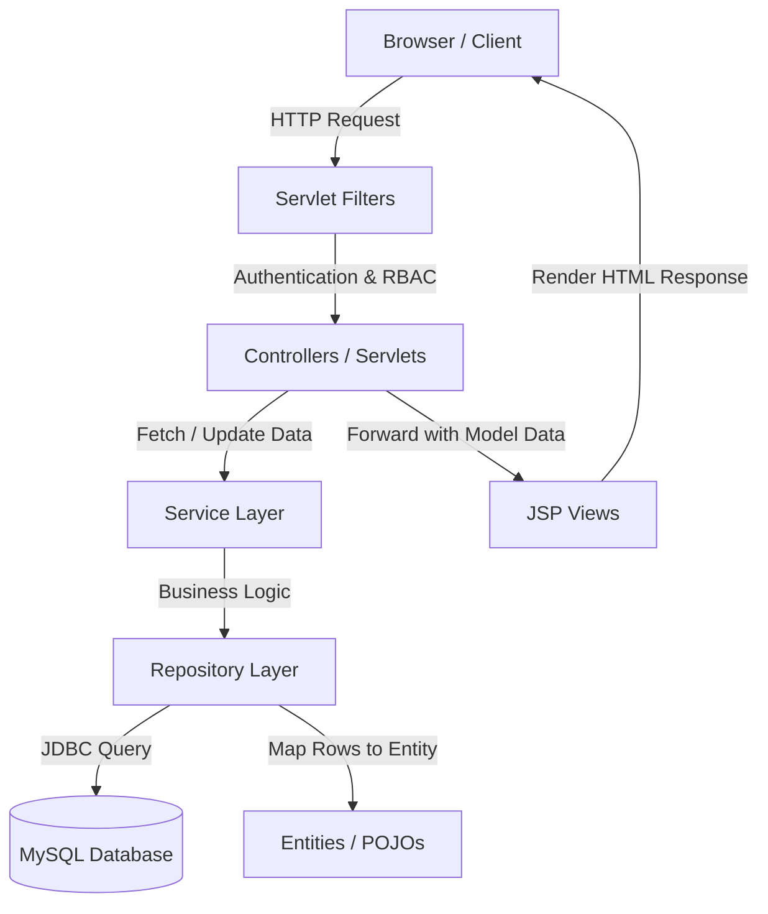

# System Architecture

The Project Management System (PMS) strictly adheres to the standard **Model-View-Controller (MVC)** design pattern, combined with a layered **N-Tier Architecture** to decouple responsibilities, simplify testing, and ease maintenance.

---

## 1. Directory & Packaging Structure

- `src/main/java/hdatuan/controller/`
  Handles incoming HTTP requests, extracts request parameters, calls the service layer, and forwards the response to the correct view or triggers a redirect.
- `src/main/java/hdatuan/service/`
  Implements core business logic and workflows. It acts as an intermediary layer between Controllers and Repositories.
- `src/main/java/hdatuan/repository/`
  Directly interacts with the database via JDBC. It contains raw SQL queries and handles mapping database rows into Java entity objects.
- `src/main/java/hdatuan/entity/`
  Plain Old Java Objects (POJOs) mapping directly to the MySQL database tables (`User`, `Role`, `Job`, `Task`).
- `src/main/java/hdatuan/filter/`
  Servlet Filters that inspect requests globally (e.g., checking if the user session exists, validating permissions).
- `src/main/java/hdatuan/config/`
  Database configuration parameters and driver connection establishment class (`MySQLConfig`).
- `src/main/webapp/WEB-INF/views/`
  JSP views containing the HTML layouts, styled with Bootstrap, and rendered dynamically via JSTL tags.

---

## 2. Request & Data Flow

For any administrative route (e.g., `GET /user`):
1. **Client Request:** The user navigates to `/user`.
2. **Filter Interception:** 
   - `AuthenticationFilter` ensures a valid session exists. If not, it redirects the browser to `/login`.
   - `AuthorizationFilter` verifies that the logged-in user has the appropriate role. If not, it forwards the user to the `/403` forbidden page.
3. **Controller Execution:** The `UserController` receives the request, sets up model attributes, and invokes `UserService.getAllUsers()`.
4. **Service Process:** `UserService` coordinates the database retrieval by calling `UserRepository.findAll()`.
5. **Data Access & Mapping:** `UserRepository` connects to MySQL via `MySQLConfig`, runs the select query, maps the returned `ResultSet` into `User` entities, and closes the connection.
6. **View Forwarding:** The Controller binds the list of users to the request attributes and forwards the request to `/WEB-INF/views/user-table.jsp`.
7. **JSP Rendering:** Tomcat renders the JSP file to standard HTML and writes the response stream back to the client.
