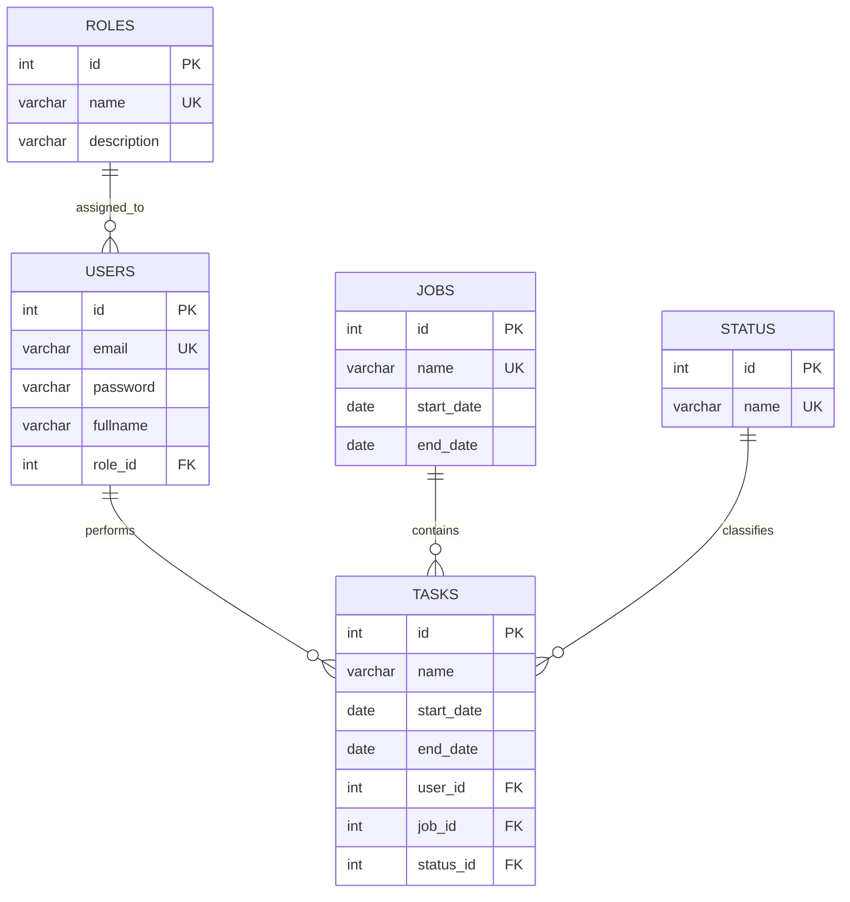

# Database Schema

The Project Management System database is named `pms` and runs on **MySQL 8.0+** using the **InnoDB** storage engine to support transactional safety and foreign key constraints.

---

## 1. Table Definitions

### `roles`
Stores the access levels and permissions definitions.
- `id` (INT, Primary Key, Auto Increment)
- `name` (VARCHAR(50), Unique, Not Null): Role code (e.g., `ADMIN`, `MANAGER`, `STAFF`).
- `description` (VARCHAR(255)): Human-readable role description.

### `users`
Contains account credentials and user profile information.
- `id` (INT, Primary Key, Auto Increment)
- `email` (VARCHAR(100), Unique, Not Null): Login credential.
- `password` (VARCHAR(100), Not Null): Account password.
- `fullname` (VARCHAR(100), Not Null): Full name of the user.
- `role_id` (INT, Foreign Key): References `roles(id)`.

### `jobs`
Represents corporate projects or high-level milestones.
- `id` (INT, Primary Key, Auto Increment)
- `name` (VARCHAR(100), Unique, Not Null): Project name.
- `start_date` (DATE, Not Null)
- `end_date` (DATE, Not Null)
- *Constraint:* `CHECK (end_date >= start_date)`

### `status`
A dictionary of valid statuses for system tasks.
- `id` (INT, Primary Key, Auto Increment)
- `name` (VARCHAR(50), Unique, Not Null): (e.g., `Chưa thực hiện`, `Đang thực hiện`, `Đã thực hiện`).

### `tasks`
Individual assignments linked to users, jobs, and statuses.
- `id` (INT, Primary Key, Auto Increment)
- `name` (VARCHAR(100), Not Null): Brief task description.
- `start_date` (DATE, Not Null)
- `end_date` (DATE, Not Null)
- `user_id` (INT, Foreign Key): References `users(id)`.
- `job_id` (INT, Foreign Key): References `jobs(id)`.
- `status_id` (INT, Foreign Key): References `status(id)`.
- *Constraint:* `CHECK (end_date >= start_date)`

---

## 2. Integrity & Deletion Cascades

To maintain database consistency and prevent orphaned rows, the following relational constraints are configured:
- **`roles` -> `users`:** Restricts deletion of roles if they are currently assigned to any user (`ON DELETE RESTRICT`).
- **`users` -> `tasks`:** Restricts user deletion if they have active tasks assigned (`ON DELETE RESTRICT`).
- **`jobs` -> `tasks`:** CASCADE deletion is handled transactionally by the application logic during deletion. Removing a project will automatically remove all tasks nested within that project.
